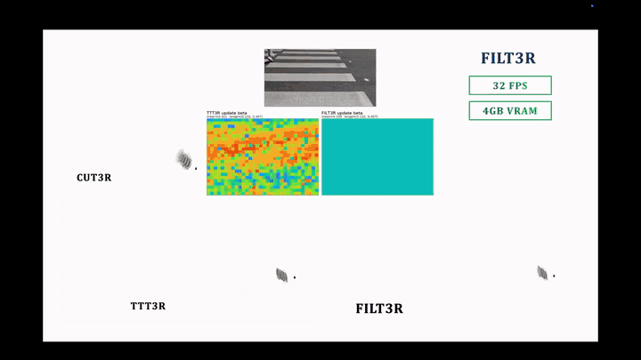

<h2 align="center">
  <a href="https://arxiv.org/abs/2603.18493">FILT3R: Latent State Adaptive Kalman Filter for Streaming 3D Reconstruction</a>
</h2>

<h5 align="center">

[](https://arxiv.org/abs/2603.18493)
[](https://github.com/jinotter3/FILT3R)
[](https://jinotter3.github.io/)

[Seonghyun Jin](https://jinotter3.github.io/), Jong Chul Ye

KAIST AI
</h5>

<div align="center">
TL;DR: FILT3R is a training-free latent filtering layer that stabilizes long-horizon streaming 3D reconstruction by replacing heuristic state updates with a Kalman-style token update.
</div>
<br>

## News

- **FILT3R is accepted to ECCV 2026.**
<br>

<!-- GitHub README pages do not reliably render repository-relative MP4 files inline.
     To show a true video player, upload assets/highlight.mp4 in the GitHub Markdown
     editor and replace this GIF block with the generated github.com/user-attachments URL. -->
<p align="center">
  
  <br>
  <sub>Inline 4x preview. Full MP4: <a href="assets/highlight.mp4">assets/highlight.mp4</a>.</sub>
</p>
<br>

FILT3R builds on the public CUT3R/TTT3R-style streaming reconstruction codebase. This release keeps the public surface focused on the three update rules used in the paper:

- `cut3r`: the original overwrite-style recurrent update.
- `ttt3r`: the TTT3R confidence-aware update.
- `filt3r`: the FILT3R adaptive latent filtering update.

## Getting Started

### Installation

1. Clone FILT3R.

```bash
git clone https://github.com/jinotter3/FILT3R.git
cd FILT3R
```

2. Create the environment.

The public release was tested with CUDA 12.8. Install PyTorch with pip wheels:

```bash
conda create -n filt3r python=3.11 cmake=3.14.0
conda activate filt3r
pip install torch torchvision --index-url https://download.pytorch.org/whl/cu128
pip install -r requirements.txt
# issues with pytorch dataloader, see https://github.com/pytorch/pytorch/issues/99625
conda install 'llvm-openmp<16'
# for evaluation
pip install accelerate evo open3d
```

3. Compile the CUDA kernels for RoPE, following CroCo v2 / CUT3R.

```bash
cd src/croco/models/curope
python setup.py build_ext --inplace
cd ../../../..
```

### Download Checkpoints

FILT3R uses the official CUT3R 4-64 view checkpoint: [`cut3r_512_dpt_4_64.pth`](https://drive.google.com/file/d/1Asz-ZB3FfpzZYwunhQvNPZEUA8XUNAYD/view?usp=drive_link).

Download the weights into `src/`:

```bash
pip install gdown
cd src
gdown --fuzzy https://drive.google.com/file/d/1Asz-ZB3FfpzZYwunhQvNPZEUA8XUNAYD/view?usp=drive_link
cd ..
```

You can also use a different compatible checkpoint by passing `--model_path` to the demo or setting `MODEL_WEIGHTS=...` for evaluation.

### Inference Demo

Run FILT3R on a video or an image folder:

```bash
CUDA_VISIBLE_DEVICES=0 python demo.py \
  --model_path src/cut3r_512_dpt_4_64.pth \
  --size 512 \
  --seq_path examples/demo.mp4 \
  --output_dir tmp/filt3r_demo \
  --port 8080 \
  --model_update_type filt3r \
  --frame_interval 1 \
  --downsample_factor 100 \
  --vis_threshold 6.0
```

A small wrapper is also provided:

```bash
bash run_demo.sh examples/demo.mp4 tmp/filt3r_demo
```

To compare the supported update rules, change only `--model_update_type`:

```bash
python demo.py --model_update_type cut3r  ...
python demo.py --model_update_type ttt3r  ...
python demo.py --model_update_type filt3r ...
```

For `filt3r`, the public hyperparameters are applied automatically. Override them with repeated `--model_hparam KEY=VALUE`, for example:

```bash
python demo.py --model_update_type filt3r --model_hparam kalman_fixed_r=0.8
```

### Evaluation

The public evaluation entrypoints are:

- `eval/relpose/run_tum.sh`
- `eval/relpose/run_scannet.sh`
- `eval/video_depth/run_bonn.sh`
- `eval/video_depth/run_kitti.sh`
- `eval/mv_recon/run.sh`
- `eval/mv_recon/run_nrgbd.sh`

Example long-horizon pose run:

```bash
CUDA_VISIBLE_DEVICES=0 \
MODEL_NAMES="cut3r ttt3r filt3r" \
MODEL_WEIGHTS=src/cut3r_512_dpt_4_64.pth \
bash eval/relpose/run_tum.sh
```

Example 3D reconstruction run:

```bash
CUDA_VISIBLE_DEVICES=0,1 \
MODEL_NAMES="cut3r ttt3r filt3r" \
FRAME_BUDGETS="300 500" \
bash eval/mv_recon/run.sh
```

Dataset layout, environment variables, and additional commands are documented in [eval/eval.md](eval/eval.md).

### Dataset Preparation

The preprocessing scripts accept explicit roots and do not assume a local machine layout:

```bash
python datasets_preprocess/long_prepare_tum.py \
  --input-root /path/to/tum \
  --output-root data/long_tum_s1

python datasets_preprocess/long_prepare_bonn.py \
  --input-root /path/to/rgbd_bonn_dataset \
  --output-root data/long_bonn_s1/rgbd_bonn_dataset

python datasets_preprocess/long_prepare_scannet.py \
  --input-root /path/to/scannetv2 \
  --output-root data/long_scannet_s3 \
  --sample-interval 3

python datasets_preprocess/long_prepare_kitti.py \
  --input-root /path/to/kitti/val \
  --output-root data/long_kitti_s1/depth_selection/val_selection_cropped
```

For acquiring the raw datasets and matching the long-horizon protocol, follow the public TTT3R dataset instructions.

## Acknowledgements

This repository follows the public release structure and evaluation conventions of [TTT3R](https://github.com/Inception3D/TTT3R). The FILT3R implementation builds on code and ideas from:

- [CUT3R](https://github.com/CUT3R/CUT3R)
- [TTT3R](https://github.com/Inception3D/TTT3R)
- [DUSt3R](https://github.com/naver/dust3r)
- [CroCo](https://github.com/naver/croco)
- [MonST3R](https://github.com/Junyi42/monst3r)
- [Spann3R](https://github.com/HengyiWang/spann3r)
- [Viser](https://github.com/nerfstudio-project/viser)

We thank the authors for releasing their code.

## Citation

If you find FILT3R useful, please cite:

```bibtex
@article{jin2026filt3r,
  title   = {FILT3R: Latent State Adaptive Kalman Filter for Streaming 3D Reconstruction},
  author  = {Jin, Seonghyun and Ye, Jong Chul},
  journal = {arXiv preprint arXiv:2603.18493},
  year    = {2026}
}
```

## License

This repository contains code derived from upstream projects with separate licensing terms, including CUT3R, TTT3R, DUSt3R, and CroCo components. Check [LICENSE](LICENSE) and the upstream licenses before redistributing weights, datasets, or derivative releases.
